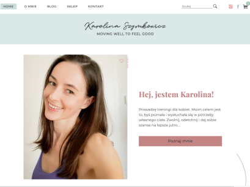

# Website including blog and e-commerce store

Website including blog and e-commerce store, based on a self-written theme.

Live demo: [https://karolinaszymkowicz.pl/](https://karolinaszymkowicz.pl/)

## Table of Contents
* [General Info](#general-information)
* [Technologies Used](#technologies-used)
* [Screenshots](#screenshots)
* [Setup](#setup)
* [Further plans](#further-plans)

## General Information

    Website including blog and e-commerce store, based on a self-written theme, implemented in Wordpress.
    The theme was created using HTML, CSS, SCSS, Bootstrap, Javascript, Jquery. 
    Then it was implemented into Wordpress using PHP. Woocommerce plugin used was also personalized using PHP.
    
    The website was designed according to the client's wishes, fitting her fitness brand, the colors and design 
    matching the style of the account maintained on Instagram.

## Technologies Used

- HTML 5
- CSS 3
- SASS 1.34.1
- Bootstrap 4.6.0
- jQuery 3.6.0
- PHP 8.0
- WordPress 5.7.2 

## Screenshots

## Setup
Live demo: [https://karolinaszymkowicz.pl/](https://karolinaszymkowicz.pl/)

## Further plans

- improve SEO
- make the template fully editable
- work on improving accessibility

